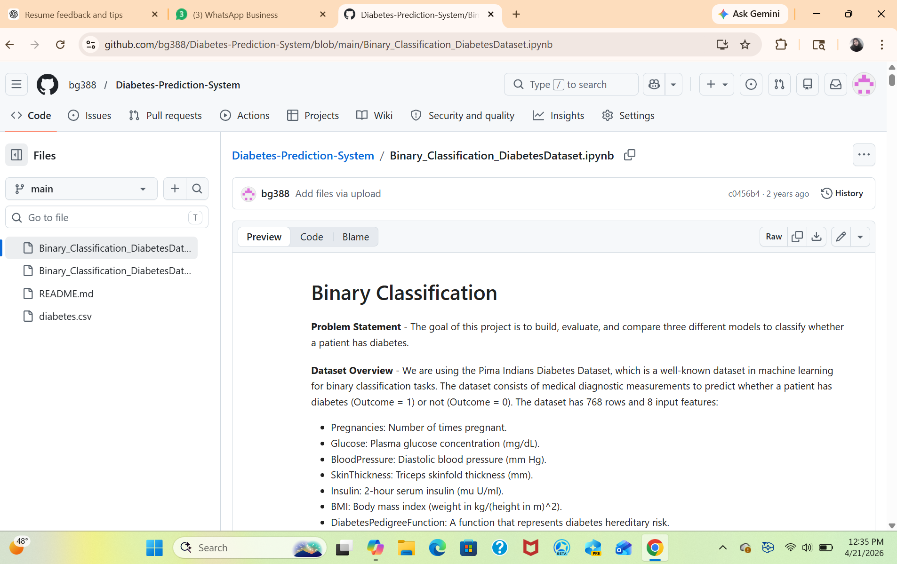

# Diabetes Prediction System

## Description
This project analyzes a diabetes dataset to predict outcomes using basic data analysis techniques.

## Technologies Used
- Python
- Pandas
- NumPy
- Jupyter Notebook

## Features
- Data preprocessing
- Analysis of diabetes dataset
- Basic prediction logic

## How to Run
1. Download the project
2. Open the .ipynb file in Jupyter Notebook
3. Run all cells

## Author
Gullapudi Bhuvanasri Venkata Pavani

## Output

